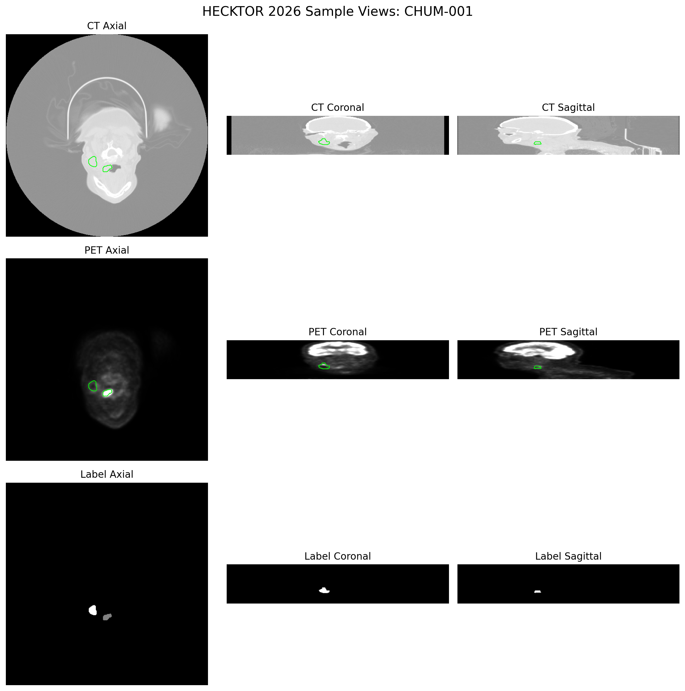
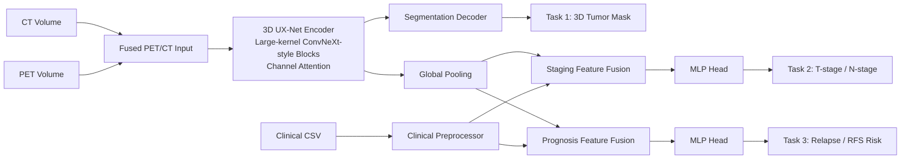

# HERO for HECKTOR 2026

HERO is a complete research pipeline for the HECKTOR 2026 Challenge covering three tightly coupled tasks:

1. 3D tumor segmentation from PET/CT.
2. TN staging with T-stage and N-stage prediction.
3. Prognosis modeling with relapse classification and relapse-free survival risk estimation.

The repository is designed to start on `data/sample_5/` and switch automatically to `data/hecktor2026_training/` once the full training set is available.



## Core Methodology

Our solution is built around four principles:

1. A multi-task network with a 3D UX-Net style encoder inside an nnU-Net style workflow. The encoder uses large-kernel ConvNeXt-inspired 3D blocks plus channel attention to learn PET/CT weighting directly from the fused image volume.
2. Out-of-fold label noise reduction. A fast 3D segmentation model is trained in 5-fold cross-validation, then original masks are compared against OOF predictions to flag noisy cases and create a cleaned training index.
3. Multi-modal fusion. Global image features from the encoder bottleneck are fused with processed clinical features for TN staging and prognosis modeling.
4. T4-safe inference. Sliding-window inference and batch size 1 keep memory usage compatible with practical competition hardware.

## End-to-End Architecture



## Repository Layout

```text
HERO/
├── configs/
│   ├── common_config.yaml
│   └── model_configs.yaml
├── hero/
│   ├── data/
│   ├── models/
│   └── utils/
├── pipeline/
│   ├── step1_label_cleaning.py
│   ├── step2_train_multitask.py
│   └── step3_inference.py
├── eda_images.py
├── eda_clinical.py
├── sample_slice_grid.png
└── README.md
```

## Data Assumptions

- Sample image data: `data/sample_5/<PatientID>/`
- Sample clinical table: `data/sample_5/HECKTOR_2026_training_data.csv`
- Full training data target: `data/hecktor2026_training/`

Each patient folder is expected to contain:

- `<PatientID>__CT.nii.gz`
- `<PatientID>__PT.nii.gz`
- `<PatientID>.nii.gz` for the segmentation mask

## Clinical Processing

`eda_clinical.py` performs:

- kNN imputation for numerical missing values such as tobacco, alcohol, and performance status.
- Most-frequent imputation plus one-hot encoding for categorical clinical variables.
- Target encoding for T-stage and N-stage.
- Export of processed features and preprocessing artifacts to `outputs/clinical/`.

## MONAI Transform Stack

The training and evaluation loaders use the required MONAI preprocessing:

```python
from monai.transforms import Compose, LoadImaged, EnsureChannelFirstd, EnsureTyped, Orientationd, Spacingd, CenterSpatialCropd, SpatialPadd, ScaleIntensityRangePercentilesd

train_transforms = Compose([
    LoadImaged(keys=["image", "label"]),
    EnsureChannelFirstd(keys=["image", "label"]),
    EnsureTyped(keys=["image", "label"]),
    Orientationd(keys=["image", "label"], axcodes="RAS"),
    Spacingd(keys=["image", "label"], pixdim=(4.0, 4.0, 6.4), mode=("bilinear", "nearest")),
    CenterSpatialCropd(keys=["image", "label"], roi_size=(64, 64, 64)),
    SpatialPadd(keys=["image", "label"], spatial_size=(64, 64, 64)),
    ScaleIntensityRangePercentilesd(keys="image", lower=0, upper=99.5, b_min=0, b_max=1),
])
```

## User Manual

### 1. Environment activation

If using `venv`:

```bash
source .venv/bin/activate
```

If using Conda:

```bash
conda activate hero
```

### 2. Move into the repository

```bash
cd /data/khkim/1_users/1_adelie/1_projects/3_hero/all_HERO/HERO
```

### 3. Run EDA

```bash
python3 eda_images.py --data-root data/sample_5 --output sample_slice_grid.png
python3 eda_clinical.py --clinical-csv data/sample_5/HECKTOR_2026_training_data.csv --output-dir outputs/clinical
```

### 4. Edit the shared configuration

Update `configs/common_config.yaml` to control:

- `paths`: data roots, clinical CSV, outputs, checkpoints.
- `data.batch_size`: training batch size.
- `optimization.learning_rate`: base optimizer LR.
- `optimization.max_epochs`: main multitask training length.
- `runtime.device`: `cuda` or `cpu`.

### 5. Run the 3-step pipeline

```bash
python3 pipeline/step1_label_cleaning.py --common-config configs/common_config.yaml --model-config configs/model_configs.yaml
python3 pipeline/step2_train_multitask.py --common-config configs/common_config.yaml --model-config configs/model_configs.yaml
python3 pipeline/step3_inference.py --common-config configs/common_config.yaml
```

### 6. Checkpoint management

Model checkpoints are written into `checkpoints/` with metric-aware filenames. The implementation uses:

```text
best_model_epoch_{e}_dice_{d:.4f}_cindex_{c:.4f}.pth
```

This follows the intended convention of storing epoch and validation metrics in the filename, similar to `model_epoch_X_val_dice_Y_cindex_Z.pth`.

### 7. Outputs

- EDA image: `sample_slice_grid.png`
- Processed clinical tables: `outputs/clinical/`
- Cleaned label index: `outputs/cleaned_dataset_index.json`
- Training history: `checkpoints/training_history.json`
- Inference masks: `outputs/inference/segmentation/*.nii.gz`
- Staging and prognosis table: `outputs/inference/staging_prognosis_predictions.csv`

## Pipeline Summary

### Step 1. OOF label cleaning

`pipeline/step1_label_cleaning.py` trains a fast 3D MONAI UNet in 5-fold cross-validation, compares OOF predictions against original masks, and writes a cleaned patient index.

### Step 2. Multi-task training

`pipeline/step2_train_multitask.py` trains a shared 3D UX-Net style encoder with:

- A decoder head for tumor segmentation.
- A staging head for T-stage and N-stage prediction using pooled image features plus partial clinical features.
- A prognosis head for relapse and RFS prediction using pooled image features plus the full processed clinical vector.

### Step 3. T4-safe inference

`pipeline/step3_inference.py` runs sliding-window inference with batch size 1, exports segmentation masks in NIfTI format, and writes task 2 and task 3 predictions to CSV.

## Competition Readiness Notes

- The code is modular so stronger losses, survival objectives, and ensembling can be added without changing the repository layout.
- The data discovery logic is config-driven and will use the full HECKTOR 2026 training directory automatically when it becomes available.
- The cleaned label index from step 1 is enforced during step 2 training to reduce supervision noise.
